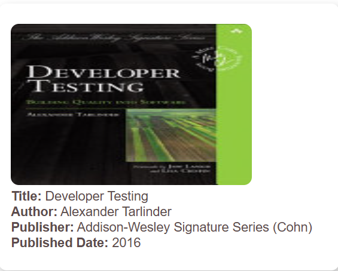
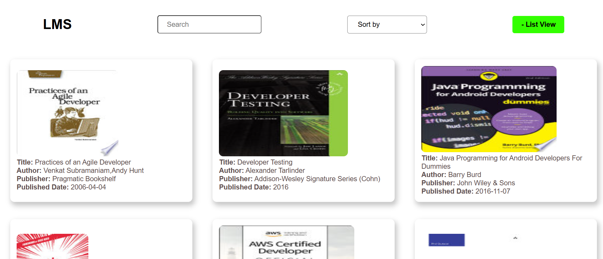

# 📚 Library Management System (LMS)

Welcome to LMS, a simple yet powerful library management system. This application displays a list of books, including their titles, authors, and publishers. The LMS is built using HTML, CSS, and JavaScript and fetches books from a free API.

## 🚀 Features

- 📖 View Books in List or Grid Format – Fetch books from a free API and display them in a list or grid view.

- 🖼️ Book Details – Each book includes a thumbnail, title, authors, and publisher.

- 🔍 Search Functionality – Easily filter books based on title or author.

- 🔄 Sorting Options – Sort books alphabetically by title or by oldest to newest.

- 🎛 Toggle View Mode – Switch between list view and grid view with a button.

- 📌 Book Details Page – Click on a book to view detailed information on a separate page.

- 📱 Responsive Design – Works seamlessly on all screen sizes, from desktops to mobile devices.

## 🛠️ How to Use

- Clone or Download the repository.
- Open the project in your preferred IDE.
- The app contains:

  - 2 HTML files (index.html, bookdetails.html)
  - 2 CSS files (styles.css, bookdetails.css)
  - 2 JavaScript files (script.js, bookdetails.js)

- If you're using VS Code, open index.html with Live Server.
- The app will load books from the API and allow you to use all the features.

## 🤝 Contributionn

If you find areas for improvement, have bug fixes, or want to add more features, feel free to contribute! Pull requests are welcome.

#

## 🎉 Enjoy the App!
 https://shimmering-quokka-6c8e6b.netlify.app/ 
 